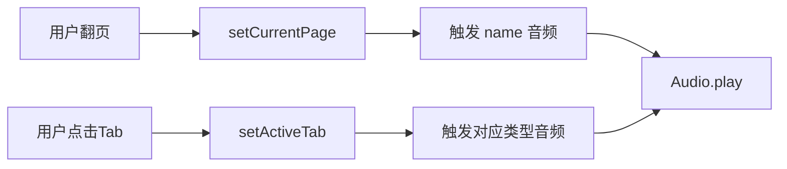

# 声音功能需求变更设计

> **Project:** 奥特曼魔法书 (Ultraman Magic Book)
> **Date:** 2025-04-21
> **Status:** Pending User Approval
> **Author:** Sisyphus

---

## 1. 需求背景

### 1.1 问题陈述

当前奥特曼魔法书应用仅有视觉展示功能，缺乏语音交互能力。用户希望新增声音功能，增强4岁儿童的交互体验。

### 1.2 用户需求

- 声音功能默认开启
- 每打开一页，朗读该页奥特曼的名字
- 点击信息按钮后，朗读具体内容

### 1.3 成功标准

- [ ] 翻页时自动朗读当前页奥特曼名称
- [ ] 点击各Tab标签时朗读对应内容
- [ ] 声音功能默认开启，可手动关闭
- [ ] 无额外费用产生

---

## 2. 功能设计

### 2.1 音频内容矩阵

| 触发场景 | 朗读内容 | 文件命名 | 数量 |
|---------|---------|---------|------|
| 翻页进入 | 奥特曼名称 | `name/{id}.mp3` | 31 |
| 点击「简介」Tab | 简介文字 `desc` | `desc/{id}.mp3` | 31 |
| 点击「形态」Tab | 形态列表或"无多种形态" | `forms/{id}.mp3` | 31 |
| 点击「技能」Tab | 技能列表 | `skills/{id}.mp3` | 31 |
| 点击「人间体」Tab | 人间体信息 | `human/{id}.mp3` | 31 |
| 点击「台词」Tab | 经典台词 | `catchphrase/{id}.mp3` | 31 |

**总计:** 186 个音频文件

### 2.2 音频目录结构

```
public/audio/
 ├── name/
 │   ├── 1.mp3   # 奥特Q
 │   ├── 2.mp3   # 初代奥特曼
 │   └── ...
 ├── desc/
 │   ├── 1.mp3
 │   └── ...
 ├── forms/
 ├── skills/
 ├── human/
 └── catchphrase/
```

### 2.3 技术实现

| 项目 | 方案 |
|------|------|
| 音频生成 | edge-tts (免费CLI工具) |
| 语音库 | zh-CN-XiaoxiaoNeural |
| 音频格式 | MP3 |
| 播放方式 | HTML5 Audio API |
| 存储位置 | `public/audio/` (静态资源) |

---

## 3. 用户界面变更

### 3.1 现有界面保持不变

- 左页：奥特曼图片
- 右页：信息展示（5个Tab）
- 底部：翻页导航

### 3.2 新增交互

| 交互 | 触发 | 响应 |
|------|------|------|
| 翻页 | 点击prev/next 或 手势 | 播放 `name/{id}.mp3` |
| 点击Tab | 点击任一Tab | 播放对应类型音频 |
| 声音开关 | 点击🔊/🔇按钮 | toggle `soundOn` 状态 |

### 3.3 数据流



---

## 4. 文件变更

### 4.1 新增文件

| 文件 | 说明 |
|------|------|
| `scripts/generate-audio.js` | 音频生成脚本 |
| `public/audio/*` | 186个MP3音频文件 |

### 4.2 修改文件

| 文件 | 变更 |
|------|------|
| `src/hooks/useMagicBook.js` | 添加 `playAudio`, `playTabAudio` 函数 |
| `src/components/UltramanInfo.jsx` | 点击Tab时触发对应音频 |
| `src/components/Navigation.jsx` | 翻页时触发名称音频 |

---

## 5. 测试计划

### 5.1 单元测试

- 音频文件完整性检查
- 播放函数调用验证

### 5.2 手动测试

| 测试项 | 预期结果 |
|-------|---------|
| 首次打开应用 | 自动播放第一个奥特曼名称 |
| 点击「简介」Tab | 播放简介音频 |
| 点击「形态」Tab | 播放形态音频（无形态时播放"无多种形态"） |
| 点击「技能」Tab | 播放技能列表音频 |
| 点击「人间体」Tab | 播放人间体音频 |
| 点���「台词」Tab | 播放台词音频 |
| 关闭声音 | 不播放任何音频 |

---

## 6. 风险与限制

### 6.1 已识别风险

| 风险 | 影响 | 缓解方案 |
|------|------|---------|
| edge-tts 服务不稳定 | 音频生成失败 | 重试机制，备用语音库 |
| 音频文件体积 | 186个文件占用空间 | 使用高压缩MP3 |

### 6.2 已知限制

- 需等待音频生成完成（约2-5分钟）
- 离线时无音频播放能力

---

## 7. 待处理事项

- [ ] 用户审批设计文档
- [ ] 执行音频生成（约186个文件）
- [ ] 集成播放逻辑
- [ ] 测试验证

---

## 8. 设计确认

**请确认以下事项：**

1. ✅ 音频内容覆盖所有6个Tab - **确认请回复「1可」**
2. ✅ 使用 edge-tts 免费生成方案 - **确认请回复「2可」**
3. ✅ 接受音频离线不可用的限制 - **确认请回复「3可」**

**设计审批:** 请回复「可开始执行」或具体修改意见。